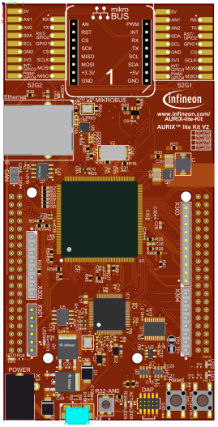
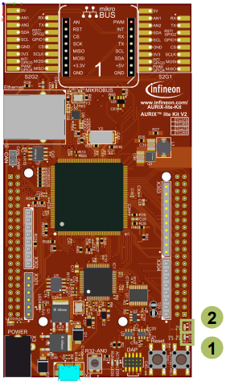

  

# MCMCAN_1_KIT_TC375_LK
MCMCAN is used to exchange data between two nodes, implemented between two boards. Also this example can work in a LOOPBACK mode. There is a macro called CAN_MODE and it can have three values: LOOPBACK, TWO_CONTROLLER_MODE_1 and TWO_CONTROLLER_MODE_2. Based on the value of this macro, communication is chosen.

## Device  
The device used in this example is AURIX&trade; TC37xTP_A-Step.

## Board  
The board used for testing is the AURIX&trade; TC375 lite Kit (KIT_A2G_TC375_LITE).

## Scope of work  
When a CAN message is transmitted, a transmission complete interrupt is generated and LED1 is turned on, indicating that the CAN message has been successfully sent.

When a CAN message is received and stored in the dedicated RX buffer, a receive interrupt is generated and LED2 is turned on, indicating successful CAN message reception.

Both CAN boards are programmed with the same application code. The only difference between the two boards is the configuration of the CAN message identifiers.
On one board, the message identifiers are defined as:

CAN_MESSAGE_ID1 = 0x777

CAN_MESSAGE_ID2 = 0x888

On the other board, these message identifiers are reversed, meaning:

CAN_MESSAGE_ID1 = 0x888

CAN_MESSAGE_ID2 = 0x777

This configuration allows each board to transmit messages using one identifier while accepting and processing messages transmitted by the other board. To define which board will be used there is BOARD - macro inside MCMCAN.h and it can be defined as 1 or 2 depending on which board is used.

## Introduction  
MCMCAN is the new CAN interface replacing MultiCAN+ module from the AURIX&trade; TC2xx family.

The MCMCAN module supports Classical CAN and CAN FD according to the ISO 11898-1 standard and Time Triggered CAN (TTCAN) according to the ISO 11898-4 standard.

The MCMCAN module consists of M_CAN as CAN nodes (in case of AURIX&trade; TC37x device, 4 nodes) which are CAN FD capable. Each CAN node communicates over two pins (TXD and RXD). Additionally, there is an internal Loop-Back Mode functionality available for test purposes.

A configurable Message RAM is used to store the messages to be transmitted or received. The message RAM is shared by all the CAN nodes within a MCMCAN module.

## Hardware setup  
This code example has been developed for the board KIT_A2G_TC375_LITE.

  

## Implementation  
**Application code can be separated into four segments:**
- Initialization of the MCMCAN module with the accompanying node and filter initialization, implemented in the *initMcmcan()* function
- Initialization of the pins that are connected to the LEDs. LEDs are used to verify the success of a CAN message transmission and reception. This is done inside the *initLeds()* function
- Transmission of the configured CAN message, implemented in the *transmitCanMessage()* function
- Initialization of pins for CAN transceiver in Driver_Port_Init() function
**Additionally, two interrupt service routines (ISRs) are implemented:**
- On TX interrupt, the LED1 is turned on to indicate successful CAN message transmission (implemented in *canIsrTxHandler()*)
- On RX interrupt, the ISR verifies the received CAN message and turns on the LED2 to indicate successful reception (implemented in *canIsrRxHandler()*)

MCMCAN module initialization

The MCMCAN module initialization is performed in three phases:

First, a default CAN module configuration is loaded into the configuration structure using the function IfxCan_Can_initModuleConfig(). The CAN module is then initialized with the user configuration by calling IfxCan_Can_initModule().

Next, a default CAN node configuration is loaded using IfxCan_Can_initNodeConfig(). A single CAN node (CAN node 0) is configured and initialized using IfxCan_Can_initNode().
The node is configured for both transmission and reception (IfxCan_FrameType_transmitAndReceive) and operates in normal mode (Loop-Back mode disabled).
Interrupts are enabled for both transmission completion and message reception, and the corresponding interrupt priorities, interrupt lines, and CPU service are configured.
Although the same physical CAN node is used, it is logically treated as a source node for transmission and a destination node for reception.

Finally, the CAN filter configuration assigns filter element 0 to RX buffer 0. The acceptance criterion is based on a matching CAN message identifier. The filter is initialized using the function IfxCan_Can_setStandardFilter().

All functions used for MCMCAN module, node, and filter initialization are declared in the iLLD header file IfxCan_Can.h.

### Initialization of the pins connected to the LEDs
LEDs are used to verify the success of a CAN message transmission and reception. Before using the LEDs, the port pins to which the LEDs are connected must be configured.
- First step is to set the port pins to level “HIGH”; this keeps the LEDs turned off as a default state (*IfxPort_setPinHigh()* function)
- Second step is to set the port pins to push-pull output mode with the *IfxPort_setPinModeOutput()* function
- Finally, the pad driver strength is defined through the function *IfxPort_setPinPadDriver()*

All functions are declared in the iLLD header *IfxPort.h*.

### Initialization of the CAN transceiver control pin

The CAN transceiver requires a dedicated control pin to be initialized in order to enable communication on the physical CAN bus. Before CAN communication can take place, the port pin connected to the transceiver control line must be properly configured.

First, the port pin P20.6 is configured as a push-pull output using the function IfxPort_setPinModeOutput().

Next, the port pin is set to logic level LOW using the function IfxPort_setPinLow(), which enables the CAN transceiver for normal operation.

All functions used for the transceiver control pin initialization are declared in the iLLD header file IfxPort.h.

### CAN message transmission
Before a CAN message is transmitted, two messages need to be initialized. TX message (message that will be transmitted) is initialized with the predefined content. RX message (message where the received CAN message will be stored) is initialized with some invalid data (after successful CAN transmission the data will be replaced with the valid data).
- Initialization of both TX and RX messages is done by using *IfxCan_Can_initMessage()*
- A CAN message is transmitted by using the *IfxCan_Can_sendMessage()* function. A CAN message will be continuously transmitted as long as the returned status is *IfxCan_Status_notSentBusy* (this status occurs if there is a pending transmit request) 

All functions are declared in the iLLD header *IfxCan_Can.h*.

### Software delay implementation

A software delay is used to introduce a waiting period between consecutive CAN message transmissions. The delay duration is specified in milliseconds and is implemented using the System Timer Module (STM).

First, the number of STM ticks corresponding to one millisecond is calculated based on the STM clock frequency.

Then, the total number of ticks required for the specified delay duration is computed.

Finally, the function IfxStm_waitTicks() is used to block program execution until the calculated number of STM ticks has elapsed.

All functions used for the delay implementation are declared in the iLLD header file IfxStm.h.

### Interrupt Service Routines (ISRs)
Two interrupt services routines are implemented: one ISR that is triggered with the successful CAN message transmission and a second one that is triggered with the successful CAN message reception.
- TX interrupt service routine clears the pending interrupt flag with the *IfxCan_Node_clearInterruptFlag()* function and indicates that the CAN message has been transmitted successfully by turning on LED1
- RX interrupt service routine clears the pending interrupt flag by using *IfxCan_Node_clearInterruptFlag()* function and reads the received CAN message with the *IfxCan_Can_readMessage()* function. Afterwards, the received data is compared against the transmitted data. In case of success, the LED2 is turned on to indicate that the received message is correct

The function *IfxCan_Node_clearInterruptFlag()* is declared in the iLLD header *IfxCan.h* while the function *IfxCan_Can_readMessage()* is declared in the iLLD header *IfxCan_Can.h*.

## Compiling and programming  
Before testing this code example:  
- Power the board through the dedicated power connector
- Connect the board to the PC through the USB interface  
- Build the project using the dedicated Build button  or by right-clicking the project name and selecting "Build Project"  
- To flash the device and immediately run the program, click on the dedicated Flash button 

## Run and Test
After code compilation and flashing the device, perform the following steps:
- Check that LED1 (1) is turned on (successful CAN message transmission by CAN node 0)
- Check that LED2 (2) is turned on (successful CAN message reception by CAN node 1)

  

## References  

AURIX&trade; Development Studio is available online:  
- <https://www.infineon.com/aurixdevelopmentstudio>  
- Use the "Import..." function to get access to more code examples  

More code examples can be found on the GIT repository:  
- <https://github.com/Infineon/AURIX_code_examples>  

For additional trainings, visit our webpage:  
- <https://www.infineon.com/aurix-expert-training>  

For questions and support, use the AURIX&trade; Forum:  
- <https://community.infineon.com/t5/AURIX/bd-p/AURIX>  